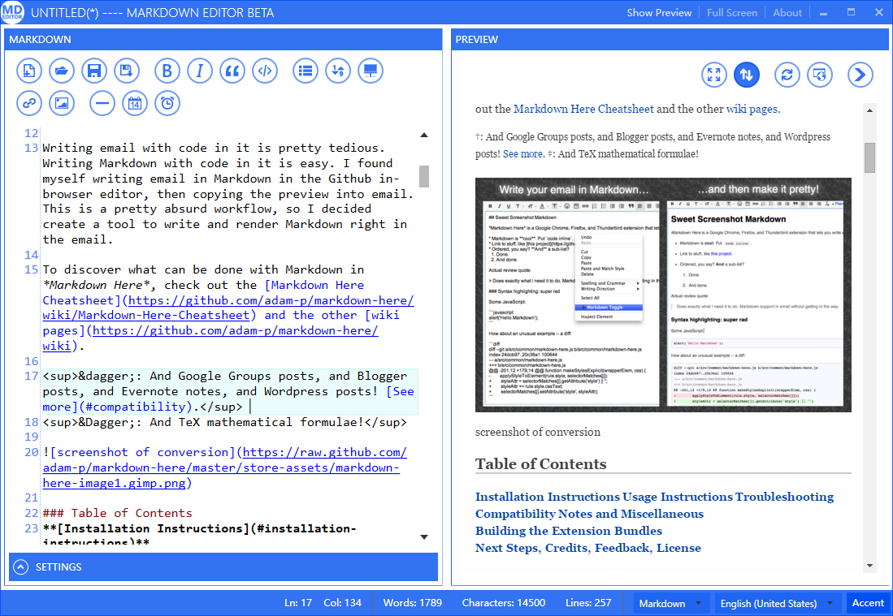

# MarkDown Editor

An open-source metro-style desktop markdown editor for Windows 7 and above. 

The license of this project is General Public License(GPL). 

Official Website: [http://chenguanzhou.github.io/MarkDownEditor/](http://chenguanzhou.github.io/MarkDownEditor/)

# Screenshot

# Features
The editor has the following `features`:

- Full-function markdown editor
- Real-time synchronization preview
- Upload local image
- Multiple markdown standards support:
	- Markdown
	- Strict Markdown
	- Github Markdown
	- PHP Markdown Extra
	- MultiMarkdown
	- CommonMark
	
- Ability to export to multiple file type:
	- plain html
	- html with css
	- rtf
	- pdf
	- docx
	- epub
	- latex
	- pdf

- Modern(Metro) Style App
- Code highlighting
- Support of English & 简体中文
- Switching the color theme
- Night Mode
- Editing Mode & Reading Mode
- Full Screen support
- MathJax support (Only for markdown processor)
- Customized Qiniu Key
- ......

# Download
> [All Release](https://github.com/chenguanzhou/MarkDownEditor/releases)

For Win7 and Win8/8.1 users, please install [.Net Framework  4.5](https://www.microsoft.com/en-us/download/details.aspx?id=30653) before running MarkDown Editor. 

For Win10 users, the .Net Framework 4.5 has been preinstalled.

# Dev
For a WPF project, I recommand VS2015 Community Edition to build.

# 3rdParty

- [Chromium Embedded Framework](https://bitbucket.org/chromiumembedded/cef)
- [CefSharp](https://github.com/cefsharp/CefSharp)
- [qiniu csharp-sdk](https://github.com/qiniu/csharp-sdk)
- [MahApps.Metro](https://github.com/MahApps/MahApps.Metro)
- [Newtonsoft.Json](https://github.com/JamesNK/Newtonsoft.Json)
- [AvalonEdit](https://github.com/icsharpcode/AvalonEdit)
- [MVVM Light Toolkit](http://www.mvvmlight.net/)
- [Imgur.API](http://imgurapi.readthedocs.org/en/latest/)
- [SimpleHelpers.Net](https://github.com/khalidsalomao/SimpleHelpers.Net)
- [UDE.CSharp](https://github.com/errepi/ude)
- [WkHtmlToXDotNet](https://github.com/chenguanzhou/WkHtmlToXDotNet)
- [The WiX Toolset](http://wixtoolset.org/)
- [MathJax](https://www.mathjax.org/)

# Thanks

- [Making AvalonEdit MVVM compatible](http://stackoverflow.com/questions/12344367/making-avalonedit-mvvm-compatible)
- [AvalonEdit :: Ctrl + I KeyBinding Doesn't Work](http://stackoverflow.com/questions/29610545/avalonedit-ctrl-i-keybinding-doesnt-work)
- [Wix 安装部署教程](http://www.cnblogs.com/stoneniqiu/category/522235.html)
- [Markdown CSS](https://github.com/markdowncss/markdowncss.github.io)
- [Markdown CSS](https://github.com/simonlc/Markdown-CSS)
- [github.css](https://gist.github.com/andyferra/2554919)
- [分享一个Markdown css](http://www.oschina.net/question/124879_76399?fromerr=LWBSwh1E)
